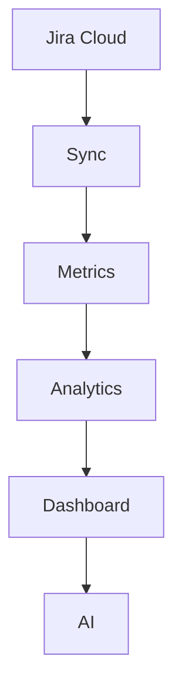

# 🚀 TeamPulse

> **Engineering Intelligence Platform**

---

# 📖 About TeamPulse

TeamPulse is an AI-powered Engineering Intelligence Platform designed to transform raw Jira activity into actionable engineering insights.

Instead of displaying only ticket counts and logged hours, TeamPulse provides management with meaningful analytics around engineering productivity, delivery health, workload distribution, technology trends and organizational performance.

The long-term vision is to build a modern SaaS platform capable of helping Engineering Managers, Delivery Managers and CTOs make data-driven decisions.

---

# 🎯 Vision

> **Transform engineering data into engineering intelligence.**

Engineering organizations generate enormous amounts of data inside Jira.

Unfortunately, most dashboards simply display numbers.

TeamPulse converts those numbers into actionable insights.

The platform should answer questions such as:

- Which teams are consistently delivering?
- Which developers are overloaded?
- Where are engineering bottlenecks?
- Which technology requires additional capacity?
- How has delivery changed month over month?
- Which projects are at delivery risk?

---

# 💡 Product Vision

TeamPulse is **not** intended to become another Jira reporting dashboard.

Instead, it aims to become an **Engineering Intelligence Platform** comparable to products like:

- Atlassian Analytics
- Linear Analytics
- GitHub Insights
- Vercel Dashboard
- Stripe Analytics

while adding AI-powered engineering recommendations.

---

# 👥 Target Users

## Engineering Managers

### Goals

- Monitor engineering productivity
- Track delivery health
- Identify bottlenecks
- Improve team performance

### Pain Points

- Difficult to compare teams
- Limited engineering insights
- No workload visibility

---

## Delivery Managers

### Goals

- Monitor monthly delivery
- Compare technology teams
- Improve delivery planning

### Pain Points

- Manual reporting
- Poor visibility into engineering capacity

---

## CTO / VP Engineering

### Goals

- Executive overview
- Engineering KPIs
- Delivery forecasting
- Strategic planning

---

## Developers

### Goals

- Personal performance insights
- Delivery history
- Workload tracking
- Career growth

---

# 🎯 Business Objectives

Every dashboard widget must help management answer:

> **"What action should we take?"**

instead of

> **"What happened?"**

The focus is on enabling decisions, not displaying data.

---

# 🏗 Core Principles

## 1. Data Driven

Every metric should originate from Jira.

No manual scoring.

---

## 2. Fairness

Developers should never be evaluated using a single metric.

Instead, TeamPulse combines multiple engineering signals.

---

## 3. Transparency

Every KPI must clearly explain:

- Calculation
- Purpose
- Interpretation

---

## 4. Actionability

Every visualization should help management make better decisions.

---

## 5. Simplicity

Complex analytics.

Simple presentation.

---

# 🧱 Current Technology Stack

## Frontend

- Next.js App Router
- React
- TypeScript
- Tailwind CSS
- shadcn/ui
- Recharts

## Backend

- Next.js API Routes
- Jira Cloud REST API

## Authentication

- Jira API Token

## Deployment

- Vercel (planned)

---

# 📊 Data Source

Single Source of Truth:

**Jira Cloud**

No duplicated database.

All analytics originate from Jira.

---

# 🗂 Available Jira Data

Current implementation supports:

- Stories
- Subtasks
- Parent Stories
- Worklogs
- Original Estimates
- Actual Time
- Developers
- Technology Mapping
- Status
- Created Date
- Updated Date

Technology Mapping

- Magento
- React JS
- HTML
- DT
- QA

---

# 🏛 Product Architecture

---

# 🎨 Design Philosophy

The dashboard should feel like a premium SaaS application.

Inspired by:

- Linear
- Vercel
- Stripe
- Atlassian Analytics

Design Principles:

- Clean
- Minimal
- Spacious
- Fast
- Professional
- Interactive

---

# 🚫 TeamPulse is NOT

- A Jira clone
- A timesheet system
- An admin template
- A leaderboard based only on hours
- An Excel replacement

---

# 🔮 Long-term Vision

Future AI capabilities include:

- AI Executive Summary
- Delivery Predictions
- Risk Detection
- Capacity Recommendations
- Sprint Retrospectives
- Natural Language Queries
- Engineering Coaching

---

# ✅ Definition of Done

A feature is complete only when:

- Business requirement is satisfied
- Code follows architecture
- Responsive UI is implemented
- Loading & error states are handled
- TypeScript types are defined
- Components are reusable
- Existing functionality remains intact
- Documentation is updated

---

# 📈 Success Criteria

Management should understand engineering health within **5 minutes** of opening the dashboard.

Developers should receive meaningful and fair performance insights.

Engineering leaders should rely on TeamPulse during monthly reviews and planning sessions.

---

# 📚 Related Documents

- 02 Engineering Architecture
- 03 Dashboard UX Specification
- 04 Metrics Definition
- 05 Implementation Roadmap
- 06 Cursor Operating Manual