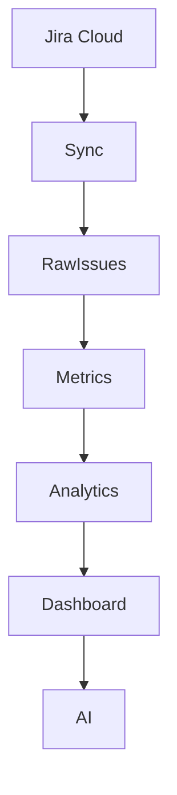

# 🏗 TeamPulse Engineering Architecture

> Version 1.0

---

# Purpose

This document defines the overall architecture of TeamPulse.

It explains:

- System architecture
- Folder structure
- Responsibilities
- Data flow
- Backend architecture
- Frontend architecture
- Metrics Engine
- Analytics Engine
- Dashboard Layer
- AI Layer
- Engineering standards

This document serves as the primary technical reference for developers contributing to TeamPulse.

---

# Guiding Principles

The architecture must be:

- Modular
- Scalable
- Testable
- Reusable
- AI Friendly
- Easy to Extend

Every module should have one responsibility.

---

# High Level Architecture



---

# Architecture Layers

```
Presentation Layer

↓

API Layer

↓

Analytics Layer

↓

Metrics Layer

↓

Jira Integration Layer

↓

Jira Cloud
```

Every layer has a single responsibility.

---

# Layer Responsibilities

## 1 Presentation Layer

Responsible for:

- Dashboard
- Charts
- Tables
- Filters
- User interactions

Technology

- Next.js
- React
- Tailwind
- shadcn/ui

Never:

- Call Jira directly
- Perform heavy calculations

---

## 2 API Layer

Responsible for

- Exposing REST endpoints
- Input validation
- Error handling
- Response formatting

Current APIs

```
/api/sync

/api/metrics

/api/contribution

/api/leaderboard
```

Future APIs

```
/api/dashboard/summary

/api/dashboard/teams

/api/dashboard/developers

/api/dashboard/trends

/api/dashboard/workload

/api/dashboard/technology

/api/dashboard/ai
```

---

## 3 Analytics Layer

This is the intelligence layer.

Responsible for:

- Delivery trends
- Team comparison
- Risk detection
- Capacity planning
- Productivity scoring

Analytics should never communicate directly with Jira.

Analytics consumes Metrics.

---

## 4 Metrics Layer

The Metrics Layer transforms raw Jira issues into engineering KPIs.

Example

Raw Jira

↓

Worklogs

↓

Developer Hours

↓

Delivery

↓

Cycle Time

↓

Monthly Metrics

No visualization logic belongs here.

---

## 5 Jira Layer

Responsible only for:

- Authentication
- Jira Search API
- Pagination
- Retry Logic
- Data Normalization

No business logic.

---

# Recommended Folder Structure

```
src/

app/

components/

hooks/

lib/

services/

types/

constants/

docs/
```

---

# Detailed Folder Structure

```
src

├── app
│
│   ├── api
│   ├── dashboard
│   ├── developers
│   ├── teams
│   ├── trends
│   └── settings
│
├── components
│
│   ├── dashboard
│   ├── charts
│   ├── developer
│   ├── team
│   ├── layout
│   └── ui
│
├── services
│
│   └── jira
│
├── lib
│
│   ├── analytics
│   ├── metrics
│   ├── ranking
│   ├── ai
│   └── utils
│
├── hooks
│
├── types
│
└── constants
```

---

# Metrics Engine

The Metrics Engine converts Jira activity into reusable metrics.

```
fetch-all-issues.ts

↓

normalize-jira-issue.ts

↓

build-worklog-index.ts

↓

build-developer-metrics.ts

↓

build-team-metrics.ts

↓

build-dashboard-summary.ts
```

Each module performs exactly one transformation.

---

# Analytics Engine

The Analytics Engine consumes metrics and creates insights.

Modules include

```
calculate-productivity.ts

calculate-utilization.ts

calculate-delivery-health.ts

calculate-risk-score.ts

calculate-consistency.ts

calculate-trends.ts
```

No Jira code should exist here.

---

# Dashboard Layer

Dashboard components never perform calculations.

Dashboard components only:

- Request API data
- Display KPIs
- Display charts
- Display tables
- Handle filtering

Business logic belongs in the backend.

---

# AI Layer

Future AI services

```
Executive Summary

↓

Delivery Prediction

↓

Risk Explanation

↓

Monthly Report

↓

Developer Feedback

↓

Natural Language Query
```

AI should consume Analytics.

AI should never read Jira directly.

---

# Data Flow

```mermaid
flowchart LR

Jira

--> Sync

--> Raw Issues

--> Metrics Engine

--> Analytics Engine

--> API

--> Dashboard

--> AI
```

---

# Dependency Rules

Allowed

Dashboard

↓

API

↓

Analytics

↓

Metrics

↓

Jira

Not Allowed

Dashboard

❌ Jira

Analytics

❌ React Components

Metrics

❌ UI

Jira

❌ Dashboard

---

# State Management

Use React state for:

- Filters
- Selected Month
- Technology
- Search

Do NOT store business calculations in client state.

Calculations belong to APIs.

---

# Error Handling

Every API must return

```
success

message

data

error
```

Never expose raw Jira errors.

Log internally.

Return user-friendly messages.

---

# Performance Strategy

- Cache Jira requests
- Reuse calculations
- Lazy load heavy charts
- Memoize expensive components
- Virtualize long tables

Dashboard target:

Load under 3 seconds.

---

# Coding Standards

Every module must:

- Have one responsibility
- Be strongly typed
- Export reusable functions
- Avoid duplicate logic
- Be unit testable

---

# Naming Conventions

Files

```
build-developer-metrics.ts

calculate-cycle-time.ts

developer-summary.ts
```

Components

```
DeveloperCard

MetricCard

TrendChart

Heatmap

TechnologyOverview
```

Never use generic names.

---

# Testing Strategy

Each Metrics function should have unit tests.

Analytics should be deterministic.

Dashboard components should avoid business logic.

---

# Security

Never expose

- Jira API Token
- Internal URLs
- User credentials

All Jira communication happens server-side.

---

# Scalability

Future integrations:

- GitHub
- Bitbucket
- Azure DevOps
- GitLab

The Analytics Engine should remain source-independent.

---

# Architecture Decisions

## ADR-001

Monthly analytics are preferred over sprint analytics.

Reason:

Management reviews engineering performance monthly.

Sprint lengths vary.

Monthly comparison is more meaningful.

Status:

Accepted ✅

---

# Related Documents

- 01 Project Charter
- 03 Dashboard UX Specification
- 04 Metrics Definition
- 05 Implementation Roadmap