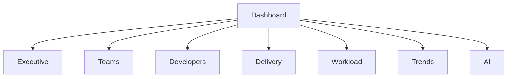

# 🎨 TeamPulse Dashboard UX Specification

> Version 1.0

---

# Purpose

This document defines the complete user experience of TeamPulse.

It describes:

- Dashboard philosophy
- Navigation
- Information hierarchy
- User journeys
- Visual hierarchy
- Component behavior
- Responsive design
- Interactions
- Animations

The objective is to create an Engineering Intelligence Platform that feels like a premium SaaS product rather than an internal reporting dashboard.

---

# UX Philosophy

TeamPulse is designed around one principle:

> **Every screen should help management make a better engineering decision.**

The dashboard should never overwhelm users with data.

Instead it should guide them from:

**Overview**

↓

**Insights**

↓

**Investigation**

↓

**Action**

---

# Design Inspiration

The visual language should combine the best ideas from:

- Linear
- Stripe Dashboard
- Vercel
- Atlassian Analytics
- GitHub Insights
- Notion

Characteristics:

- Modern
- Minimal
- Spacious
- Fast
- Professional
- Premium

---

# Design Principles

## Clarity

Every widget should answer one question.

Never mix unrelated KPIs.

---

## Visual Hierarchy

Important information should naturally attract attention.

The eye should flow from:

1. Executive KPIs
2. Trends
3. Teams
4. Developers
5. Insights

---

## Progressive Disclosure

Do not display every metric immediately.

Start with summaries.

Allow drill-down into details.

---

## Consistency

Cards

Charts

Buttons

Spacing

Typography

Animations

should all follow a consistent design language.

---

# Navigation Structure

```
Dashboard

│

├── Executive Overview

├── Developers

├── Teams

├── Delivery

├── Workload

├── Trends

├── Leaderboard

├── AI Insights

└── Settings
```

---

# Information Architecture



---

# Dashboard Layout

```
---------------------------------------------------

Header

---------------------------------------------------

Global Filters

---------------------------------------------------

Executive KPI Cards

---------------------------------------------------

Delivery Trend

Productivity Trend

---------------------------------------------------

Technology Overview

Resource Utilization

---------------------------------------------------

Top Contributors

Risk Center

---------------------------------------------------

Workload Heatmap

---------------------------------------------------

AI Executive Summary

---------------------------------------------------
```

---

# Global Header

The header should include:

Logo

Current Month

Global Search

Technology Filter

Theme Toggle

User Menu

Notifications (future)

---

# Global Filters

Persistent across the application.

Filters include:

Month

Technology

Developer

Issue Type

Status

Date Range

Filters should update every widget.

---

# Executive KPI Cards

Four premium KPI cards.

## Delivery Health

Measures delivery success.

Color:

Green

---

## Engineering Productivity

Overall productivity score.

Color:

Blue

---

## Resource Utilization

Capacity usage.

Color:

Purple

---

## Delivery Risk

Projects needing attention.

Color:

Orange

---

Each card includes:

Current Value

Monthly Change

Mini Trend

Tooltip

Click Action

---

# Delivery Trend

Large interactive chart.

Supports:

Monthly

Quarterly

Yearly

Hover

Zoom

Export

---

# Technology Overview

Cards for:

Magento

React

HTML

DT

QA

Each card includes:

Developers

Tickets

Hours

Health Score

Trend

Click opens Team Detail page.

---

# Developer Leaderboard

NOT a ranking by hours.

Display:

Avatar

Developer

Technology

Overall Score

Monthly Trend

Achievements

Consistency

Click opens Developer Profile.

---

# Risk Center

Highlights:

High WIP

Long Cycle Time

Blocked Work

Delivery Delays

Reopened Issues

This section should immediately tell management where intervention is required.

---

# Workload Heatmap

Visualize workload by:

Developer

Week

Month

Overloaded developers should be highlighted.

---

# AI Executive Summary

Positioned at the bottom of the dashboard.

Contains:

Monthly Summary

Delivery Risks

Positive Highlights

Recommended Actions

Future Prediction

---

# Developer Detail Page

Contains:

Profile

Monthly Trend

Delivery History

Worklogs

Technology

Achievements

Estimate Accuracy

Productivity Trend

AI Feedback

---

# Team Detail Page

Contains:

Team KPIs

Capacity

Monthly Trend

Developer Comparison

Technology Health

AI Summary

---

# Charts

Use charts only when they communicate trends.

Preferred:

Line

Area

Bar

Stacked Bar

Heatmap

Radar

Donut

Avoid unnecessary pie charts.

---

# Tables

Tables should support:

Sorting

Filtering

Search

Sticky Header

Pagination

CSV Export

---

# Empty States

Every page must have meaningful empty states.

Example:

"No worklogs found for selected month."

Instead of blank screens.

---

# Loading States

Use Skeleton Loaders.

Never show layout shifts.

---

# Error States

Friendly messages.

Retry button.

Technical errors should never be shown directly.

---

# Animations

Use subtle motion.

Recommended:

Card hover

Counter animation

Chart animation

Smooth page transitions

Avoid excessive animations.

---

# Color Philosophy

Green

Healthy

Blue

Information

Orange

Attention

Red

Critical

Gray

Neutral

Never rely on color alone.

Use icons and labels.

---

# Typography

Primary Font

Inter

Hierarchy:

H1

Dashboard Title

H2

Section

H3

Card Title

Body

14–16px

Small

12px

---

# Spacing

Use an 8px spacing system.

Examples:

8

16

24

32

48

64

Consistency is mandatory.

---

# Responsive Design

Desktop

Primary experience.

Tablet

Fully supported.

Mobile

Essential KPIs only.

---

# Accessibility

Keyboard navigation.

Screen reader support.

Color contrast.

Tooltips.

Focus indicators.

---

# UX Success Metrics

A first-time user should understand:

Overall engineering health

within

30 seconds.

A manager should identify delivery risks

within

60 seconds.

A developer should locate personal insights

within

15 seconds.

---

# Future UX Enhancements

Dark Mode

Saved Views

Custom Dashboards

Drag-and-drop Widgets

Natural Language Search

Real-time Notifications

Executive PDF Export

---

# Related Documents

- 01 Project Charter

- 02 Engineering Architecture

- 04 Metrics Definition

- 05 Implementation Roadmap