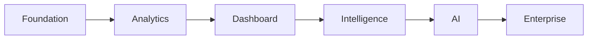

# 🚀 TeamPulse Product Delivery Roadmap

> Version 1.0

---

# Purpose

This document defines the implementation strategy for TeamPulse.

It breaks development into milestones, epics, deliverables and acceptance criteria.

Every feature developed in TeamPulse must belong to a milestone.

This roadmap is the single source of truth for engineering execution.

---

# Product Vision

Build TeamPulse into an AI-powered Engineering Intelligence Platform that enables engineering leaders to make data-driven decisions.

The roadmap follows an incremental delivery model.

Every milestone must leave the application deployable.

---

# Delivery Strategy

Instead of building everything together, TeamPulse will evolve through multiple phases.

Each phase delivers business value independently.



---

# Phase 1 — Foundation

**Goal**

Build a reliable engineering data platform.

Status

🟢 In Progress

---

## Epic 1

### Jira Integration

Tasks

- Connect Jira Cloud API
- Authentication
- Pagination
- Error Handling
- Retry Strategy

Status

✅ Completed

---

## Epic 2

### Data Collection

Tasks

- Fetch Issues
- Fetch Worklogs
- Fetch Parent Stories
- Technology Mapping
- Monthly Search

Status

✅ Completed

---

## Epic 3

### Metrics Engine

Tasks

- Normalize Jira Issues
- Build Worklog Index
- Developer Metrics
- Team Metrics
- Dashboard Summary

Status

🟡 In Progress

Priority

Critical

---

## Deliverables

✔ Stable Jira Integration

✔ Monthly Analytics

✔ Metrics Engine

---

# Phase 2 — Dashboard Experience

Goal

Build a beautiful management dashboard.

Status

🔵 Planned

---

## Epic 4

Executive Dashboard

Tasks

- KPI Cards
- Trend Charts
- Team Overview
- Risk Center
- AI Placeholder

---

## Epic 5

Developer Dashboard

Tasks

Developer Profile

Monthly Trend

Achievements

Delivery History

Workload

Consistency

---

## Epic 6

Team Dashboard

Tasks

Technology Overview

Capacity

Delivery Trend

Team Health

Comparison

---

## Deliverables

Interactive Dashboard

Responsive Design

Premium UI

---

# Phase 3 — Advanced Analytics

Status

Planned

---

## Epic 7

Delivery Analytics

Features

Cycle Time

Lead Time

Throughput

Velocity

Monthly Comparison

---

## Epic 8

Engineering Health

Features

Risk Score

Capacity

Consistency

Work Distribution

Blocked Work

---

## Epic 9

Leaderboard

Features

Balanced Score

Top Contributors

Recognition

Achievements

Historical Ranking

---

# Phase 4 — AI Intelligence

Status

Future

---

## Epic 10

AI Executive Summary

Generate:

Monthly Summary

Delivery Highlights

Risks

Recommendations

Achievements

---

## Epic 11

Engineering Assistant

Questions like

"What slowed React team?"

"Who needs help?"

"What changed since last month?"

---

## Epic 12

Predictive Analytics

Delivery Forecast

Risk Forecast

Capacity Prediction

Trend Forecast

---

# Phase 5 — Enterprise Features

Status

Future

---

Features

Role Based Access

Teams

Departments

Organizations

Multi Project Support

Benchmarking

Audit Logs

Notification Center

---

# Milestone Priority

Priority | Milestone
---------|-----------
P0 | Metrics Engine
P1 | Dashboard
P2 | Analytics
P3 | AI
P4 | Enterprise

---

# Current Sprint (Active)

Objective

Complete backend architecture before major UI development.

Tasks

- Finalize Metrics Engine
- Refactor APIs
- Improve folder structure
- Define dashboard APIs
- Build reusable services

Success Criteria

Metrics are reliable.

Dashboard APIs are stable.

---

# Risks

## Technical Risks

Jira API rate limits

Large worklog volume

Performance

Caching

---

## Product Risks

Unfair productivity metrics

Misleading KPIs

Poor management interpretation

---

## UX Risks

Information overload

Too many charts

Confusing navigation

---

# Acceptance Criteria

Every milestone must satisfy:

- Business value delivered
- Documentation updated
- Responsive UI
- API documented
- Components reusable
- Unit testing completed
- Cursor implementation reviewed

---

# Development Workflow

```mermaid
flowchart TD

Requirement

--> Architecture

--> Documentation

--> Cursor Implementation

--> Code Review

--> Testing

--> Merge

--> Release
```

---

# Branch Strategy

main

Production-ready

develop

Integration

feature/*

New features

bugfix/*

Bug fixes

hotfix/*

Production fixes

---

# Release Strategy

v0.1

Backend Foundation

v0.2

Dashboard MVP

v0.3

Analytics

v0.4

AI

v1.0

Production Ready

---

# Success Metrics

Project success is measured by:

- Dashboard load time <3s
- 100% documented APIs
- Reusable component architecture
- Accurate engineering metrics
- Positive management feedback
- High maintainability

---

# Out of Scope (v1)

GitHub Integration

Azure DevOps

Slack Bot

Mobile App

Browser Extension

Employee Monitoring

---

# Related Documents

- 01 Project Charter
- 02 Engineering Architecture
- 03 Dashboard UX Specification
- 04 Metrics Definition
- 06 Cursor Operating Manual